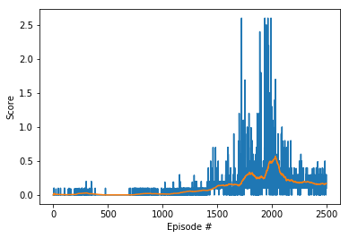

# Report: Project2-Continuous-Control

### Learning Algorithm

This project implemented a Multi-agent Reinforcement Learning algorithm - MADDPG [1]. This method has a framework of centralized training and decentralized execution. Each agent in the multi-agent system has its own actor network and critic network. The actor network of agent $i$ sees local information $o_i$ and outputs an action $a_i$ for itself only. The actor network of agent $i$ takes as input a global state information (in the simplest case, the global state information could consist of the observations of all agents) as well as the actions of all agents and outputs the Q-value for agent $i$.  Compared to regular actor-critic algorithms, the critic in MADDPG is augmented with extra information about the policies of other agents and is called a centralized action-value function. A primary motivation behind MADDPG is that, if we know the actions taken by all agents, the environment is stationary even as the policies change.

Since each centralized action-value function is learned separately, agents can have arbitrary reward structures, including conflicting rewards in a competitive setting. In this project, we tested a collaborative game.

#### Hyperparameters
- LR_ACTOR = 1e-2         # actor learning rate
- LR_CRITIC = 1e-4        # critic learning rate
- BATCH_SIZE = 128        # minibatch size
- GAMMA = 0.99            # discount factor
- TAU = 0.001             # for soft update of target parameters
- BUFFER_SIZE = int(1e6)  # replay buffer size

#### Model architecture
```Python
class Actor(nn.Module):
    h_dim = 128
    def __init__(self, o_dim, a_dim, seed):
        super(Actor, self).__init__()
        torch.manual_seed(seed)
        self.fc1 = nn.Linear(o_dim, self.h_dim * 2)
        self.fc2 = nn.Linear(self.h_dim * 2, self.h_dim)
        self.fc3 = nn.Linear(self.h_dim, a_dim)
        self.reset_parameters()

    def reset_parameters(self):
        self.fc1.weight.data.uniform_(*hidden_init(self.fc1))
        self.fc2.weight.data.uniform_(*hidden_init(self.fc2))
        self.fc3.weight.data.uniform_(-3e-3, 3e-3)

    def forward(self, state):
        h1 = F.relu(self.fc1(state))
        h2 = F.relu(self.fc2(h1))
        h3 = self.fc3(h2)
        norm = torch.norm(h3)
        return 10.0*(F.tanh(norm))*h3/norm if norm > 0 else 10*h3
```
h3 is a 2D vector (a force that is applied to the agent). We bound the norm of the vector to be between 0 and 10. This makes the training easier to convergence with larger learning rate.

```Python
class Critic(nn.Module):
    h_dim = 128
    def __init__(self, o_dim, a_dim, seed):
        super(Critic, self).__init__()
        torch.manual_seed(seed)
        self.fcs1 = nn.Linear(o_dim, self.h_dim * 2)
        self.fc2 = nn.Linear(self.h_dim * 2 + a_dim, self.h_dim * 2)
        self.fc3 = nn.Linear(self.h_dim * 2, self.h_dim)
        self.fc4 = nn.Linear(self.h_dim, 1)
        self.reset_parameters()

    def reset_parameters(self):
        self.fcs1.weight.data.uniform_(*hidden_init(self.fcs1))
        self.fc2.weight.data.uniform_(*hidden_init(self.fc2))
        self.fc3.weight.data.uniform_(*hidden_init(self.fc3))
        self.fc4.weight.data.uniform_(-3e-3, 3e-3)

    def forward(self, state, action):
        xs = F.leaky_relu(self.fcs1(state))
        x = torch.cat((xs, action), dim = 1)
        x = F.relu(self.fc2(x))
        x = F.relu(self.fc3(x))
        return self.fc4(x)
```
The critic network represents the centralized action-value function, which takes as input the global state information (observations of all agents) as well as the actions of all agents, and outputs the Q-value.

### Plot of Rewards


The agents are trained with 2500 episodes. The problem is solved at around 2010 episodes. 

```Python
self.actor_scheduler = MultiStepLR(self.actor_optimizer, milestones = [1500, 2000], gamma = 0.1)
```
`MultiStepLR` is add to actor optimizer. It decays the learning rate of each parameter group by 0.1 once the number of epoch reaches 1500 and 2000. This implementation stables the model training.


What's inside:
- `model.py` defines the actor and critic network architecture
- `OUNoise.py` Ornstein-Uhlenbeck process, used for adding exploration
- `buffer.py` stores transitions collected at each step and reuse them for training
- `ddpg.py`  initializes and updates critic and actor networks for each agent
- `maddpg.py` controls the behavior of the multi-agent system

The expected outputs of this implement are:
- critic network weights: `checkpoint_critic1.pth`, `checkpoint_critic2.pth`
- actor network weights: `checkpoint_actor1.pth`, `checkpoint_actor2.pth`


### Ideas for Future Work
- try "Inferring policies of other agents" and "policy ensembles" as suggested in Lowe's paper
- try prioritized experience replay
- try N-step returns
- implement Proximal Policy Optimization (PPO) for better performance

## References
[1] R. Lowe,  Y.  I. Wu,  A.  Tamar,  J. Harb,  O.  P.  Abbeel,  and I.  Mordatch.  Multi-agent  actor-criticfor mixed cooperative-competitive environments.  InAdvances  in  neural  information  processingsystems, pages 6379–6390, 2017.
